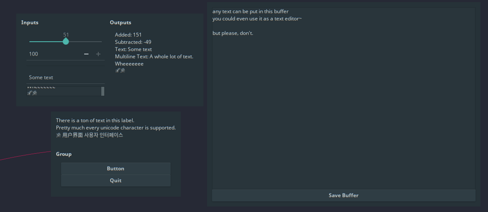

# Improved User Interface
## A cross-platform UI toolkit for Rust based on libui
[](https://travis-ci.com/rust-native-ui/libui-rs)
[](https://ci.appveyor.com/project/rust-native-ui/libui-rs)


iui: [](https://crates.io/crates/iui/)
[](https://docs.rs/iui)
ui-sys: [](https://crates.io/crates/ui-sys/)
[](https://docs.rs/ui)

`iui` is a **simple** (about 4 kLOC of Rust), **small** (about 800kb, including `libui`), **easy to distribute** (one shared library) GUI library, providing a **Rusty** user interface library that binds to **native APIs** via the [libui](https://github.com/andlabs/libui) and the `ui-sys` bindings crate.

`iui` wraps native retained mode GUI libraries, like Win32API on Windows, Cocoa on Mac OS X, and GTK+ on Linux and elsewhere. Thus all `iui` apps have a native look and feel and start from a highly performant base which is well integegrated with the native ecosystem on each platform. Because it implements only the least common subset of these platform APIs, your apps will work on all platforms and won't have significant behavioral inconsistencies, with no additional effort on your part.

## Using

Add `iui` to your project with:

```toml
iui = "0.3"
```

Then, in your code, all you have to do is:

1. create a [`UI`](https://docs.rs/iui/*/iui/struct.UI.html#method.init) handle, initializing the UI library and guarding against memory unsafety
1. make a [window](https://docs.rs/iui/*/iui/controls/struct.Window.html), or a few, with title and platform-native decorations, into which your app will be drawn
1. add all your [controls](https://docs.rs/iui/*/iui/controls/index.html), like buttons and text inputs, laid out with both axial and grid layout options
1. implement some [callbacks](https://docs.rs/iui/*/iui/controls/struct.Button.html#method.on_clicked) for user input, taking full advantage of Rust's concurrency protections
1. call [`UI::main`](https://docs.rs/iui/*/iui/struct.UI.html#method.main), or take control over the event processing with an [`EventLoop`](https://docs.rs/iui/*/iui/struct.EventLoop.html), and voíla! A GUI!

Or, you can track the `master` branch, which may be broken and whose API often changes, with:

```toml
iui = { git = "https://github.com/rust-native-ui/libui-rs.git" }
```

We have documentation on [docs.rs](https://docs.rs/iui) for released versions and on [github](https://rust-native-ui.github.io/libui-rs/iui/index.html) for master.

## Examples



Check out the [`examples/`](https://github.com/rust-native-ui/libui-rs/tree/0.3.0/iui/examples) directory from the latest release for these examples and more.

## Organization

This repository contains multiple Rust crates: 

* `iui` is the safe Rust wrapper, to be used by most users.
* `ui-sys` is the raw unsafe bindings to the `libui` C code. Requires `cmake` so it can build `libui`. `libui` is included as a submodule. 

Also be sure to look at our [changelog](CHANGELOG.md) and learn [how to contribute](CONTRIBUTING.md).


### Building ui-sys

`ui-sys` includes `libui` as a sub-module and allows it to be built on-the-fly with the
default features `fetch` and `build. With `fetch disabled, it will simply build the
existing sources without updating them, and with `build` disabled it will build nothing,
assuming either a system or local (in `./lib/`) version of `libui` is available.

Note that _most of the time_, building `libui` on the fly is what you want. It does however
require a copy of cmake, essential build tools, et cetera.

## Acknowledgments

Based on work by [@pcwalton](https://github.com/pcwalton/).
